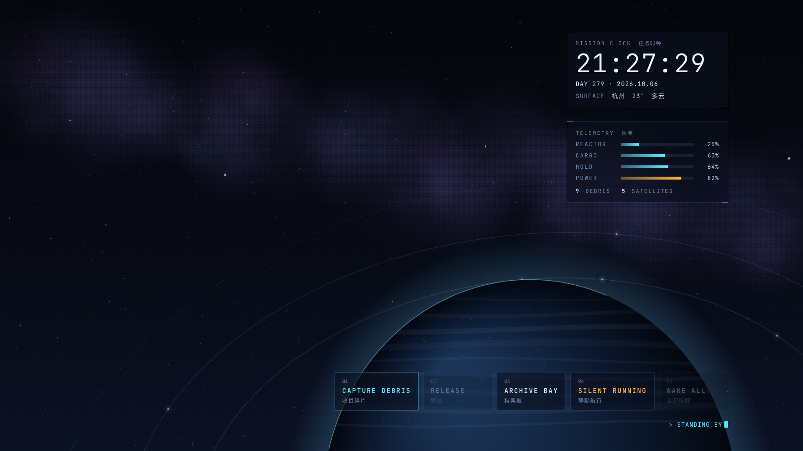
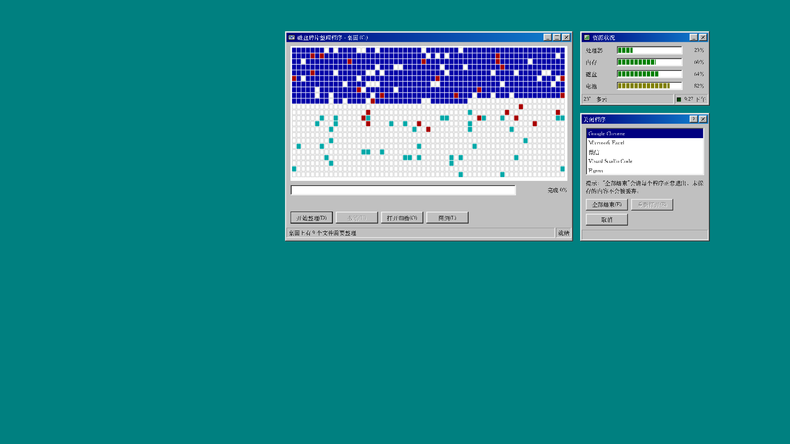
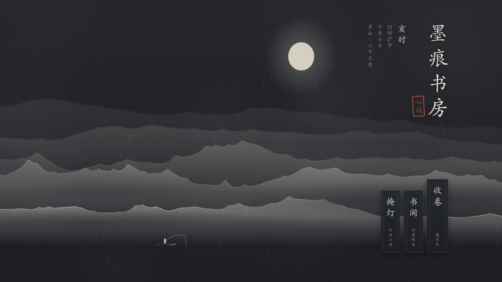
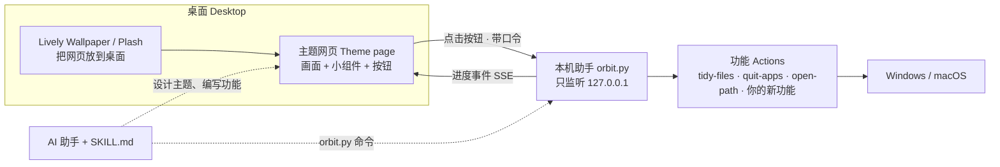

# Orbit Desktop

**让桌面成为一个完整的设计：壁纸、动效、小组件和一键功能属于同一个世界。**
A desktop where wallpaper, motion, widgets and one-click functions belong to one designed world.

[中文](#中文) · [English](#english)


| 深空轨道 · Deep Orbit | 磁盘整理 95 · Defrag 95 |
|---|---|
|  |  |

---

## 中文

### 这是什么

市面上的 AI 壁纸工具大多只换图案。Orbit Desktop 是一个 **Skill**（Claude Code、Codex 等 AI 编程助手都能用），也是一套能独立运行的小工具。它让 AI 帮你设计整个桌面：

- **图案、风格、动效、动画**：主题就是一张网页，画面、排版、动态完全自由。
- **桌面功能**：一键收纳桌面文件（可撤销）、一键收工关闭应用（绝不强制关闭）、打开文件夹……也可以让 AI 写一个你想要的新功能。
- **功能和美学融为一体**：同一个“收纳”，在水墨主题里是散页飞入书卷的“收卷”，在太空主题里是把碎片捕获进档案轨道，在 95 主题里就是磁盘碎片整理。桌面上有几个散落文件，太空里就漂着几块碎片；开着几个应用，轨道上就亮着几颗卫星；电量是书房里的“灯油”。

支持 **Windows 10/11** 和 **macOS**（Linux 可以预览）。

### 三套示例主题

| 主题 | 世界 | 一键收纳 | 一键收工 | 数据 |
|---|---|---|---|---|
| 墨痕书房 | 雾中远山的书房，竖排楷体 | 「收卷」：文件化作纸笺飞入书卷，可「展卷」撤销 | 「掩灯」：先点亮灯光确认，墨色渐沉 | 时辰、中文数字日期、灯油=电量、雨天落墨 |
| 深空轨道 | 行星轨道上的任务控制台 | 「收拢碎片」：碎片被捕获进档案轨道 | 「静默航行」：卫星一颗颗熄灭 | 散落文件=碎片数，应用=卫星数，CPU=反应堆 |
| 磁盘整理 95 | 1995 年的 Windows | 就是磁盘碎片整理：读、写、蓝色归位 | “关闭程序”对话框，列出真实运行的程序 | “资源状况”窗口、托盘时钟 |

同一套主题会跟着真实的时间和天气变化，比如夜里下雨的墨痕书房：



### 快速体验（不需要 AI）

**Windows**：下载本仓库（Code → Download ZIP，解压），双击 `start-windows.bat`。没有 Python 会提示一键安装。菜单里可以全屏预览、换主题、设为桌面壁纸、设置天气城市。

**macOS**：双击 `start-mac.command`（第一次需要右键 → 打开）。

设为壁纸时，Windows 使用免费开源的 [Lively Wallpaper](https://www.rocksdanister.com/lively/)，macOS 使用免费的 [Plash](https://apps.apple.com/app/plash/id1494023538)。程序会一步步告诉你怎么做，随时可以 `uninstall` 恢复原样。

### 作为 Skill 使用（让 AI 设计你的桌面）

把仓库放进 AI 助手的 skills 目录，文件夹名保持 `orbit-desktop`：

```powershell
# Claude Code（Windows PowerShell）
git clone https://github.com/XIANYU-HW/orbit-desktop "$env:USERPROFILE\.claude\skills\orbit-desktop"
```
```bash
# Claude Code（macOS / Linux）
git clone https://github.com/XIANYU-HW/orbit-desktop ~/.claude/skills/orbit-desktop
# Codex
git clone https://github.com/XIANYU-HW/orbit-desktop ~/.agents/skills/orbit-desktop
```

然后直接说：

- “用 orbit-desktop 给我设计一个雨夜图书馆风格的桌面，要有一键收纳和一键收工。”
- “给我加一个按钮，一键关掉所有浏览器，风格要和现在的主题一致。”
- “做一个新功能：把桌面上的截图按月份归档。”

AI 会先写出这个桌面的“世界观”和每个功能的隐喻，再写主题、截图检查，最后帮你放到桌面上。

### 它是怎么工作的



- **主题**（`themes/`）是普通网页，用 `sdk/orbit.js` 连接功能、时间、天气、系统状态。
- **功能**（`actions/`）是独立的小程序，有统一的约定：先预览、可撤销、绝不删除、绝不强制关闭。
- **本机助手**（`runtime/`）只用 Python 标准库，无需安装任何依赖。

### 安全

- 助手只监听本机地址，每个请求都要口令，并拒绝其他网站发来的请求。你访问的网页无法操作你的桌面。
- 一键收纳只移动不删除，每一步都有日志，可以撤销；快捷方式、隐藏文件、正在下载或刚改过的文件不会动。
- 一键收工只发送正常的关闭请求；有未保存内容的应用会停下来问你。终端、AI 工具、密码管理器、同步、VPN/代理、安全软件始终保留。
- 关闭应用前会先显示将关闭哪些应用，再点一次才执行。

### 目录

```
SKILL.md              AI 读的说明书
references/           设计方法、主题指南、功能指南、宿主与排错
runtime/orbit.py      本机助手和命令行
sdk/orbit.js          主题 SDK；sdk/gallery.html 主题画廊
actions/              内置功能
themes/               三套示例主题
templates/            新主题、新功能的模板
tests/                自动测试（Windows / macOS / Linux 持续集成）
```

---

## English

### What it is

Most AI wallpaper tools stop at the picture. Orbit Desktop is a **skill** for AI coding agents (Claude
Code, Codex and others following the Agent Skills format) and a small tool that runs on its own. It
designs the whole desktop:

- **Picture, style, motion:** a theme is a web page, so anything goes.
- **Functions:** tidy loose desktop files (undoable), wind down open apps (never force-quit), open
  folders, or any new function the agent writes for you.
- **Function and aesthetics fused:** "tidy" is rolling paper slips into a scroll in the ink theme,
  capturing debris into orbit in the space theme, and literally defragmenting in the Windows 95 theme.
  Loose files become debris, open apps become satellites, the battery becomes lamp oil.

Windows 10/11 and macOS (Linux for previews).

### Try it without an agent

Windows: download the ZIP, unzip, double-click `start-windows.bat`. macOS: double-click
`start-mac.command`. The menu previews themes, switches them, puts them on the desktop (via the free
[Lively Wallpaper](https://www.rocksdanister.com/lively/) on Windows or [Plash](https://apps.apple.com/app/plash/id1494023538)
on macOS) and sets the weather place.

### Use it as a skill

Clone into your agent's skills folder as `orbit-desktop` (`~/.claude/skills/` for Claude Code,
`~/.agents/skills/` for Codex), then ask, for example: *"Use orbit-desktop to design a rainy-library
desktop with one-click tidy and wind-down."* The agent writes the theme's concept and the metaphor for
each function first, then builds, snapshots, checks and installs it. See `SKILL.md`.

### Commands

```
python runtime/orbit.py doctor | init | start | stop | themes | use ID | gallery | open [ID]
python runtime/orbit.py new-theme ID [--from THEME] | validate ID | snapshot ID
python runtime/orbit.py actions | run ACTION [OP] [--params JSON] [--yes] | new-action ID
python runtime/orbit.py set-location CITY | install | uninstall | autostart on|off
```

### Safety

The helper listens on 127.0.0.1 only, requires a per-install token, checks Host and Origin, and sends no
CORS headers, so web pages cannot trigger your desktop. Tidying only moves and journals files and can be
undone. Winding down only sends normal close requests and keeps terminals, AI tools, password
managers, sync, VPN and security software open. Closing apps always asks for a second click.

## License

MIT. Lively Wallpaper and Plash are separate projects by their own authors.
