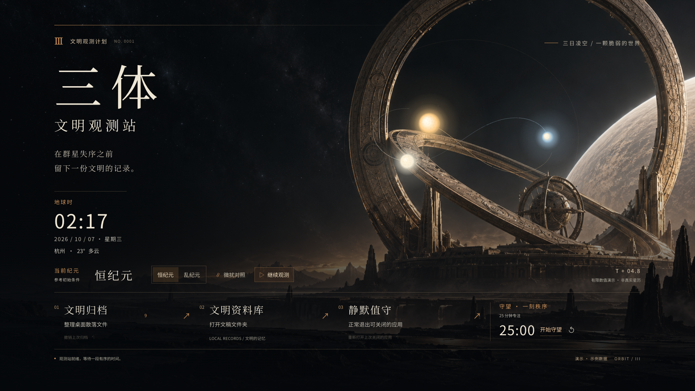
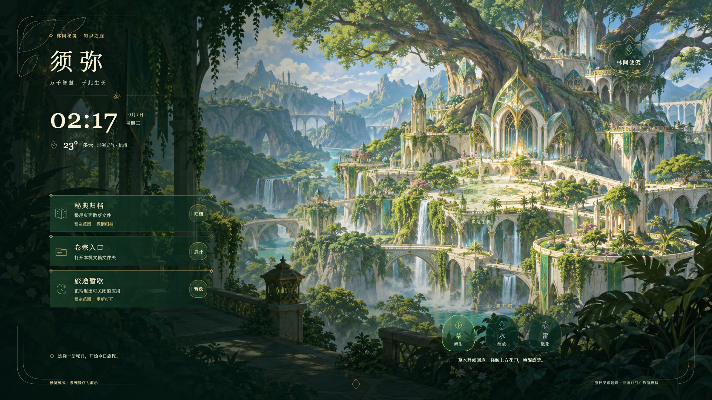

# Orbit Desktop
### 把你想象的世界，做成每天使用的桌面。
**Turn a world you love into a desktop you can live in.**

[](https://github.com/XIANYU-HW/orbit-desktop/actions/workflows/ci.yml)
[**进入主题展厅 →**](https://xianyu-hw.github.io/orbit-desktop/) · [三体试玩](https://xianyu-hw.github.io/orbit-desktop/themes/threebody-observatory/?demo=1&lang=zh-CN) · [原神试玩](https://xianyu-hw.github.io/orbit-desktop/themes/genshin-sumeru/?demo=1&lang=zh-CN) · [使用方法](#开始使用) · [English](#english)

Orbit Desktop 是一个面向 **Codex、Claude Code 等 AI 编程助手的桌面设计 Skill**，附带可独立运行的主题引擎与本机工具。给它一个世界、一种情绪，或一套工作习惯；让 AI 从主题内核出发，设计画面、运动、交互，以及每天真正会用的功能。

你可以在三日凌空的观测台建立秩序，也可以在须弥的林间整理卷宗。**外观、行为和工具，共同构成主题。**

---

## 01 / 三体 · 文明观测站
### 在不可预测的世界，留下秩序。

[](https://xianyu-hw.github.io/orbit-desktop/themes/threebody-observatory/?demo=1&lang=zh-CN)

荒原、青铜观测环、深空中的三颗恒星。这里的主题来自“三体”中的**不可预测、观测与文明延续**：你能改变观测状态，也能为自己的工作留下一段确定的时间。

| 你做的事 | 世界的回应 |
|---|---|
| 切换恒纪元与乱纪元 | 三日的轨迹、间距与观测状态随之变化 |
| 移动指针、点击星图区 | 观测标记与局部扰动回应你的介入 |
| 开始一段专注 | 25 分钟倒计时，把注意力留在一项工作上 |
| 归档文件、打开资料、结束工作 | 通过「文明归档」「文明资料库」「静默值守」完成；保留清楚的功能说明 |

[**进入观测站 →**](https://xianyu-hw.github.io/orbit-desktop/themes/threebody-observatory/?demo=1&lang=zh-CN)

*这是文学主题的视觉演绎，轨迹是有界的概念动画，并非天体预报或科学模拟。*

## 02 / 原神 · 须弥知识之庭
### 让知识生长，让日常融入风景。

[](https://xianyu-hw.github.io/orbit-desktop/themes/genshin-sumeru/?demo=1&lang=zh-CN)

树城与瀑布向远处展开，时间栖在林荫里，工具化作庭院中的卷宗。**知识、自然与元素之间的联系**决定了这套主题的形态：它更繁复、更明亮，功能分散在适合它们的位置。

| 你做的事 | 世界的回应 |
|---|---|
| 选择草、水或雷，再触碰庭院 | 花印、绽放与枝脉光效形成不同的元素回应 |
| 暂时放下鼠标 | 水光与流叶保持轻微运动，场景仍然有生命 |
| 打开「林间便笺」 | 记下想法，便笺保存在当前浏览器本地 |
| 使用「秘典归档」「卷宗入口」「旅途暂歇」 | 同样的日常工具，重新设计为植物纹样与卷宗式控件 |

[**漫步知识之庭 →**](https://xianyu-hw.github.io/orbit-desktop/themes/genshin-sumeru/?demo=1&lang=zh-CN)

*原创同人场景与元素互动，不是游戏截图，也不复现游戏数值规则。两套主题均无官方关联或背书。[素材与创作说明](docs/showcase-art.md)*

> **在线试玩说明：** 文件、应用和天气使用示例数据；系统操作按钮只演示反馈，不访问你的文件、不退出应用。计时与便笺可在浏览器中使用，便笺只存于该浏览器本地。截图来自实际运行的主题页面。

---

## 这个 Skill 教 AI 做什么？

**从“喜欢什么”走到“如何在其中工作”。**

1. **拆解主题内核** — 从世界观、情绪、材料、构图和行为中找到关联。文学、游戏、摄影、静态排版与实用工作台都可以。
2. **设计整个桌面** — 背景、信息、按钮、输入、反馈和动效一起设计。控件可以集中，也可以融入不同位置；必需功能始终保留。
3. **实现真实功能** — 复用收纳、打开目录、收工；也可以编写计时、便笺、媒体控制或新的工作流。功能范围由需求决定。
4. **看实际效果，再修正** — 截图检查清晰度与排版，真实点击测试状态变化，在临时数据上验证文件操作，并分别记录目标桌面宿主的结果。
5. **保留旧世界** — 新主题有独立目录，现有配置和用户数据保留；安装、启动项与发布遵循用户授权。

两套主展示是完成度示例，不是固定模板。你可以让 AI 换一种完全不同的构图、材料、功能与运动方式。

### 给 AI 的一句话

> 用 orbit-desktop 做一个深海研究站桌面。主题围绕“探索与记录”，要有待办、资料入口和专注计时。声呐扫过时能与鼠标互动；整体安静，保留我的旧主题，先在浏览器给我看实际效果。

也可以只改一个细节：

> 保留现在的构图，让河流沿实际河道流动；减少全屏装饰，把整理文件的反馈融入场景。

## 开始使用

### 先试玩

[打开在线展厅](https://xianyu-hw.github.io/orbit-desktop/)。无需下载，无需桌面权限；建议使用电脑浏览器体验交互。

### 让 AI 为你设计

把仓库放入对应助手的 Skills 目录，再向助手描述需求：

```bash
# Codex — macOS / Linux
git clone https://github.com/XIANYU-HW/orbit-desktop ~/.agents/skills/orbit-desktop

# Claude Code — macOS / Linux
git clone https://github.com/XIANYU-HW/orbit-desktop ~/.claude/skills/orbit-desktop
```

```powershell
# Windows PowerShell — Codex
git clone https://github.com/XIANYU-HW/orbit-desktop "$env:USERPROFILE\.agents\skills\orbit-desktop"

# Windows PowerShell — Claude Code
git clone https://github.com/XIANYU-HW/orbit-desktop "$env:USERPROFILE\.claude\skills\orbit-desktop"
```

入口是 [SKILL.md](SKILL.md)。AI 会按需求、设计、实现、画面与交互验收、授权安装的流程工作。

### 直接运行示例

[下载 ZIP](https://github.com/XIANYU-HW/orbit-desktop/archive/refs/heads/main.zip) 并解压：

| 系统 | 启动 | 桌面宿主 |
|---|---|---|
| Windows 10/11 | 双击 `start-windows.bat` | [Lively Wallpaper](https://www.rocksdanister.com/lively/) |
| macOS | 双击 `start-mac.command`，首次可右键打开 | [Plash](https://apps.apple.com/app/plash/id1494023538) |
| Linux | 使用 Python 命令启动与浏览器预览 | 不提供原生桌面集成 |

本机助手使用 **Python 3.9+ 标准库**。首次创建工作区默认选中三体主题；已有主题选择保留。启动菜单可预览、切换主题、设置天气位置，再按需设为桌面。开机启动须主动选择。

## 实现与使用边界

| 能力 | 当前实现 |
|---|---|
| 视觉与交互 | HTML/CSS/Canvas/SVG 和本地素材；展示主题限制动画帧率与画布倍率，响应暂停、隐藏和减少动态效果设置。实际占用取决于设备与宿主。 |
| 整理文件 | 提供操作预览；两套主展示的整理与收工会先显示确认。整理只移动并记日志，不删除；撤销核对文件身份与内容，变化或状态不明的文件保留待处理。 |
| 一键收工 | 先列应用，再正常请求退出；不强退、不代答保存提示。网页标签与会话恢复取决于应用自身。 |
| AI 输入与模型选择 | **没有通用内置桥接。** 按所选应用的真实接口另行实现，区分打开草稿、发送成功与收到回答。 |
| 桌面输入 | 浏览器、Plash 与 Lively 能力不同；复杂输入、输入法、窗口层级需在实际宿主验证。 |
| 验证 | 自动检查、浏览器截图、实际交互和桌面宿主测试分别记录；CI 不能替代审美或目标设备验收。 |

本机助手只监听 `127.0.0.1`，受保护接口校验口令、Host 与 Origin。主题可调用本机功能，自定义动作可运行代码，因此应先审查来源；这不是代码沙箱。此项目与已有原生 Mac ORBIT 应用独立，不自动替换其桌面与配置。

<details>
<summary>开发结构、命令与基础示例</summary>

```text
SKILL.md              AI 的工作流程
references/           设计、实现、验收与宿主指南
themes/               两套主展示 + 三套基础示例
sdk/                  页面 SDK 与主题库
actions/              tidy-files / quit-apps / open-path
runtime/              Python 本机助手
templates/            可替换的新主题与功能骨架
tests/                跨平台自动测试
```

```text
python runtime/orbit.py doctor | init | start | stop | themes | use ID | gallery
python runtime/orbit.py new-theme ID [--from THEME] | validate ID | snapshot ID
python runtime/orbit.py review ID [--quick] [--out FOLDER]
python runtime/orbit.py actions | run ACTION [OP] [--param KEY=VALUE] [--yes]
python runtime/orbit.py install [--autostart] | uninstall | autostart on|off
```

macOS / Linux 可用 `python3`。用户工作区默认 `~/OrbitDesktop`，与仓库分离。卸载停止助手并移除其启动项，桌面宿主中的条目可能仍需手动移除。

基础示例仍保留，适合学习不同实现方式：

- [墨痕书房](https://xianyu-hw.github.io/orbit-desktop/themes/ink-study/?demo=1)：纸墨、卷轴、时辰。
- [深空轨道](https://xianyu-hw.github.io/orbit-desktop/themes/deep-orbit/?demo=1)：数据驱动的轨道与碎片。
- [磁盘整理 95](https://xianyu-hw.github.io/orbit-desktop/themes/defrag-95/?demo=1)：复古窗口与整理进度。

继续阅读：[设计原则](references/design-principles.md) · [主题指南](references/theme-guide.md) · [验收方法](references/quality-review.md) · [设计案例](references/design-cases.md) · [展示验证](docs/showcase-verification.md)

</details>

---

## English

**Orbit Desktop is an agent skill for designing a coherent, useful desktop around a world, a mood or a way of working.** It includes a portable web-theme runtime and a local Python helper. Use it with Codex, Claude Code or another compatible coding agent.

### Two worlds, different design languages

- **Three-body · Civilization Observatory** — Bronze instruments, a desolate horizon and a three-star sky. Switch between stable and chaotic eras, perturb the observation, start a focus session and archive your work. The trajectories are conceptual choreography, not astronomy.
- **Genshin · Sumeru Garden of Knowledge** — A lush tree city, waterfalls and botanical gold ornament. Dendro, water and electro produce distinct garden responses. Keep a local note and use scroll-like tools woven into the setting. An original unofficial fan interpretation, not an in-game scene.

[**Explore the live demos →**](https://xianyu-hw.github.io/orbit-desktop/)
The screenshots show running themes. Public demos simulate file/app operations and weather; the timer and browser-local notes remain usable.

### What the skill provides

A requirements-to-delivery workflow: derive the design from the brief, build artwork and useful controls together, test real interactions with temporary data, inspect renders, and verify the authorized installation in its actual host. Preserve existing themes and recoverable user data. Quiet, static, photographic and completely different layouts are equally valid.

Desktop targets: **Windows + Lively** and **macOS + Plash**. Linux supports browser previews. Python 3.9+; standard library only. Clone into `~/.agents/skills/orbit-desktop` for Codex or `~/.claude/skills/orbit-desktop` for Claude Code. Read [SKILL.md](SKILL.md), or download the ZIP and run the platform launcher.

The featured themes confirm filing and wind-down before execution; previews are also available for those actions. Tidy moves and journals files with verified undo; wind-down requests normal app closure and never force-quits or answers save prompts. Session restoration is app-dependent. There is no universal AI chat/model bridge. Browser tests do not certify Plash/Lively input or device performance. The local helper is authenticated, but themes and custom actions are trusted code, not sandboxed extensions.

## License & credits

Code: **MIT**. The two featured worlds are unofficial fan showcases with no affiliation or endorsement. Generated art, thematic references and font licenses are documented in [artwork provenance](docs/showcase-art.md). Third-party names and fictional properties belong to their respective rights holders. Lively and Plash are independent projects.
