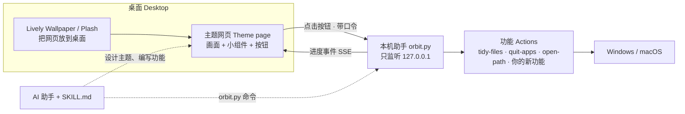

# Orbit Desktop

**让桌面成为一个完整的设计：壁纸、动效、小组件和一键功能属于同一个世界。**
A desktop where wallpaper, motion, widgets and one-click functions belong to one designed world.

[](https://github.com/XIANYU-HW/orbit-desktop/actions/workflows/ci.yml)
[在线演示 Live demo](https://xianyu-hw.github.io/orbit-desktop/) · [中文](#中文) · [English](#english)


| 深空轨道 · Deep Orbit | 磁盘整理 95 · Defrag 95 |
|---|---|
|  |  |

---

## 中文

### 这是什么

Orbit Desktop 是一个 **Skill**（Claude Code、Codex 等 AI 编程助手都能用），也是一套能独立运行的小工具。它让 AI 帮你设计整个桌面：

- **图案、风格、动效、动画**：主题就是一张网页，画面、排版、动态完全自由。
- **桌面功能**：一键收纳桌面文件（可撤销）、一键收工关闭应用（绝不强制关闭）、打开文件夹……也可以让 AI 写一个你想要的新功能。
- **功能和美学融为一体**：同一个“收纳”，在水墨主题里是散页飞入书卷的“收卷”，在太空主题里是把碎片捕获进档案轨道，在 95 主题里就是磁盘碎片整理。桌面上有几个散落文件，太空里就漂着几块碎片；开着几个应用，轨道上就亮着几颗卫星；电量是书房里的“灯油”。

面向 **Windows 10/11 + Lively Wallpaper** 与 **macOS + Plash**；Linux 可在浏览器预览。它与已有的原生 Mac 桌面应用是独立项目，使用独立工作区；安装前先核对现有桌面方案。

### 设计流程：从需求到可验证的交付

1. **明确需求**：保留必需功能、现有主题和用户数据，确认目标系统、屏幕、交互方式及性能偏好。
2. **制定设计**：从主题含义、构图、素材、字体和交互推导方案。功能可以分散融入画面，也可以集中呈现；静态、平面、像素、摄影和电影感都可以。
3. **实现与预览**：在独立工作区制作主题和自定义动作。模板是可替换的骨架，三套示例不限制新主题的风格或功能。
4. **分层验收**：自动结构检查 → 实际画面评审 → 临时数据交互测试 → 目标桌面宿主实测。缺失截图和未实现的测试状态不能算通过。
5. **安装与回退**：按授权放到桌面，记录实际结果；开机启动须显式选择。旧主题继续保留。

### 能力与边界

| 能力 | 实现与验证边界 |
|---|---|
| 自由外观与动效 | HTML/CSS/Canvas/SVG 及本地媒体。按视觉意图选素材和运动方式，无统一粒子、光晕或 60fps 要求；低动态与暂停需要实测。 |
| 自定义功能 | 三个内置动作是示例；可新增计时、媒体控制、工作流等动作。新增动作需明确权限、失败反馈和恢复方式。 |
| AI 输入框 | **没有内置通用 AI 对话/模型切换桥**。需按所选应用的实际 API 或入口实现并验证，不能把打开应用说成发送成功。输入草稿应在失焦后保留。 |
| Mac 桌面交互 | Plash 的浏览模式与浏览器窗口能力不同；复杂输入需单独验证。这里不复制或替换原生 Mac ORBIT 的能力。 |
| Windows 桌面交互 | Lively 接收安装请求不等于实际显示已验证；需在 Windows 宿主检查点击、输入、层级和恢复。 |
| 收工与恢复 | 正常请求应用退出；保存提示、后台驻留及网页标签恢复取决于应用自身，不保证恢复全部会话。 |
| 质量报告 | `review` 对所选尺寸与状态逐一截图并测量，列出实际完成数量。字体探测有局限，静态图不能证明动画、输入法、翻译气泡或性能正常。 |

CI 包括 Windows/macOS/Linux 自动测试和部分浏览器渲染；**CI 通过不代表三种桌面宿主、所有主题状态与审美均通过人工验收**。每次交付应写清观察过的画面、测试过的目标设备及仍未验证的项目。

### 三套示例主题

| 主题 | 世界 | 一键收纳 | 一键收工 | 数据 |
|---|---|---|---|---|
| 墨痕书房 | 雾中远山的书房，竖排楷体 | 「收卷」：文件化作纸笺飞入书卷，可「展卷」撤销 | 「掩灯」：先点亮灯光确认，墨色渐沉 | 时辰、中文数字日期、灯油=电量、雨天落墨 |
| 深空轨道 | 行星轨道上的任务控制台 | 「收拢碎片」：碎片被捕获进档案轨道 | 「静默航行」：卫星一颗颗熄灭 | 散落文件=碎片数，应用=卫星数，CPU=反应堆 |
| 磁盘整理 95 | 1995 年的 Windows | 就是磁盘碎片整理：读、写、蓝色归位 | “关闭程序”对话框，列出真实运行的程序 | “资源状况”窗口、托盘时钟 |

同一套主题会跟着真实的时间和天气变化，比如夜里下雨的墨痕书房：


### 快速体验（不需要 AI）

**Windows**：下载本仓库（Code → Download ZIP，解压），双击 `start-windows.bat`。没有 Python 会提示一键安装。菜单里可以全屏预览、换主题、设为桌面壁纸、设置天气城市。

**macOS**：双击 `start-mac.command`（第一次需要右键 → 打开）。

设为壁纸时，Windows 使用免费开源的 [Lively Wallpaper](https://www.rocksdanister.com/lively/)，macOS 使用免费的 [Plash](https://apps.apple.com/app/plash/id1494023538)。程序会说明设置步骤。`uninstall` 停止本机助手并移除开机启动；Lively/Plash 中的桌面条目可能需要手动移除，命令会给出结果。它不会关闭其他 Lively 壁纸。

### 作为 Skill 使用（让 AI 设计你的桌面）

把仓库放进 AI 助手的 skills 目录，文件夹名保持 `orbit-desktop`：

```powershell
# Claude Code（Windows PowerShell）
git clone https://github.com/XIANYU-HW/orbit-desktop "$env:USERPROFILE\.claude\skills\orbit-desktop"
```
```bash
# Claude Code（macOS / Linux）
git clone https://github.com/XIANYU-HW/orbit-desktop ~/.claude/skills/orbit-desktop
# Codex
git clone https://github.com/XIANYU-HW/orbit-desktop ~/.agents/skills/orbit-desktop
```

然后直接说：

- “用 orbit-desktop 给我设计一个雨夜图书馆风格的桌面，要有一键收纳和一键收工。”
- “给我加一个按钮，一键关掉所有浏览器，风格要和现在的主题一致。”
- “做一个新功能：把桌面上的截图按月份归档。”

AI 会先核对需求，再制定设计、实现和验收。有叙事主题时提炼主题内核；功能命名仍要易懂，不能为了隐喻删掉必需功能。安装、开机启动与上传依据你已给出的授权执行。

### 它是怎么工作的



- **主题**（`themes/`）是普通网页，用 `sdk/orbit.js` 连接功能、时间、天气、系统状态。
- **功能**（`actions/`）是独立的小程序，有统一的输入、结果和进度协议；改动前提供预览，并根据实际副作用设计恢复方式。
- **本机助手**（`runtime/`）只用 Python 标准库，无需安装任何依赖。

### 安全

- 助手只监听本机地址；受保护的 API 校验口令、Host 和 Origin。主题页面会获得操作权限，自定义动作能运行本机代码，因此只加载审查过的主题与动作；这不是代码沙箱。
- 一键收纳只移动不删除并记录日志；撤销会核对文件身份与内容，已修改、被替换或旧日志缺少校验信息的文件需人工处理。路径或云文件状态无法确认时保留原件。
- 一键收工只发送正常的关闭请求，不强制退出，不代答保存提示。内置保留名单保护常见终端、AI 工具、同步与安全软件；执行前仍需核对预览名单。应用是否显示保存提示由应用决定。
- 关闭应用前会先显示将关闭哪些应用，再点一次才执行。

### 目录

```
SKILL.md              AI 读的说明书
references/           设计方法、主题指南、功能指南、宿主与排错
runtime/orbit.py      本机助手和命令行
sdk/orbit.js          主题 SDK；sdk/gallery.html 主题画廊
actions/              内置功能
themes/               三套示例主题
templates/            新主题、新功能的模板
tests/                自动测试（Windows / macOS / Linux 持续集成）
```

---

## English

### What it is

Orbit Desktop is a **skill** for AI coding agents (Claude
Code, Codex and others following the Agent Skills format) and a small tool that runs on its own. It
designs the whole desktop:

- **Picture, style, motion:** a theme is a web page, so anything goes.
- **Functions:** tidy loose desktop files (undoable), wind down open apps (never force-quit), open
  folders, or any new function the agent writes for you.
- **Function and aesthetics fused:** "tidy" is rolling paper slips into a scroll in the ink theme,
  capturing debris into orbit in the space theme, and literally defragmenting in the Windows 95 theme.
  Loose files become debris, open apps become satellites, the battery becomes lamp oil.

Targets Windows 10/11 with Lively and macOS with Plash; Linux supports browser previews.
This is separate from any existing native desktop application. Use a separate workspace and preserve
existing themes. Browser rendering, automatic tests and actual desktop-host verification are distinct.

### Design and verification

Start with required functions, target device, visual intent and performance preferences. Choose a
composition, assets, typography and interactions appropriate to that brief: flat, static, pixel,
photographic and cinematic designs are all valid. Metaphors must preserve clear functionality.
The starter is replaceable; the three bundled themes are examples, not mandatory layouts.

Build and test using temporary data, inspect actual renders, then verify the authorized installation
in the target host. `review` captures and measures each planned size/state, fails on missing renders,
and records coverage. Automatic checks cannot approve aesthetics, animation, IME behavior, translation
prompts or host input. Record these separately as passed, failed, not applicable or unverified.

There is **no built-in universal AI chat/model-selection bridge**. Implement one for the user's chosen
app using a verified interface, preserve drafts on focus changes, and distinguish opening the app from
submitting a message. Do not promise the input behavior of a native app inside Plash or Lively.

### Try it without an agent

Windows: download the ZIP, unzip, double-click `start-windows.bat`. macOS: double-click
`start-mac.command`. The menu previews themes, switches them, puts them on the desktop (via the free
[Lively Wallpaper](https://www.rocksdanister.com/lively/) on Windows or [Plash](https://apps.apple.com/app/plash/id1494023538)
on macOS) and sets the weather place.

### Use it as a skill

Clone into your agent's skills folder as `orbit-desktop` (`~/.claude/skills/` for Claude Code,
`~/.agents/skills/` for Codex), then ask, for example: *"Use orbit-desktop to design a rainy-library
desktop with one-click tidy and wind-down."* The agent follows requirements, design, implementation,
visual/interaction review and authorized host verification. See `SKILL.md`.

### Commands

```
python runtime/orbit.py doctor | init | start | stop | themes | use ID | gallery | open [ID]
python runtime/orbit.py new-theme ID [--from THEME] | validate ID | snapshot ID
python runtime/orbit.py review ID [--quick] [--out FOLDER]
python runtime/orbit.py actions | run ACTION [OP] [--params JSON] [--yes] | new-action ID
python runtime/orbit.py set-location CITY | install [--autostart] | uninstall | autostart on|off
```

### Safety

The helper listens on 127.0.0.1; protected APIs check a token, Host and Origin. Served themes receive
privileged access and custom actions execute local code: load reviewed code only; this is not a sandbox.
Tidying moves and journals files; undo refuses changed/replaced files or old unverifiable journals.
Wind-down sends normal close requests, never force-quits or answers save prompts. Its allow/keep lists
need previewing; application session and tab restoration are application-dependent.

`install` does not enable autostart unless `--autostart` is supplied. A successful host command means
its request was accepted, not that the wallpaper was visually verified. `uninstall` stops the helper
and removes autostart; host entries may need manual removal. Other Lively wallpapers are not closed.
CI checks multiple operating systems and renders some examples; it does not certify all host behavior
or visual quality.

## License

MIT. Lively Wallpaper and Plash are separate projects by their own authors.
