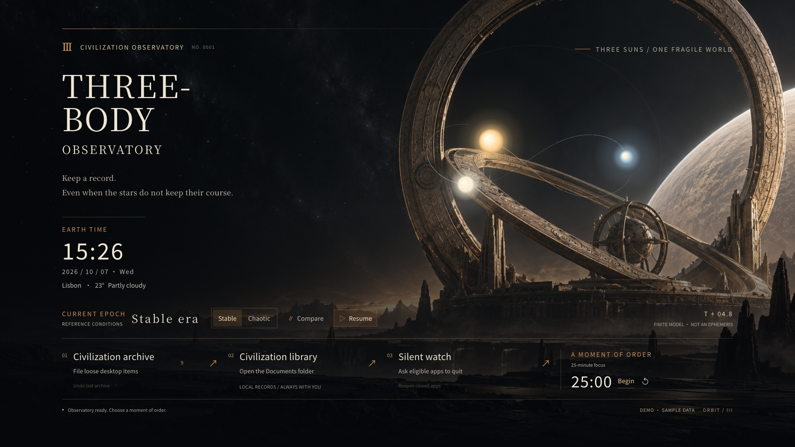
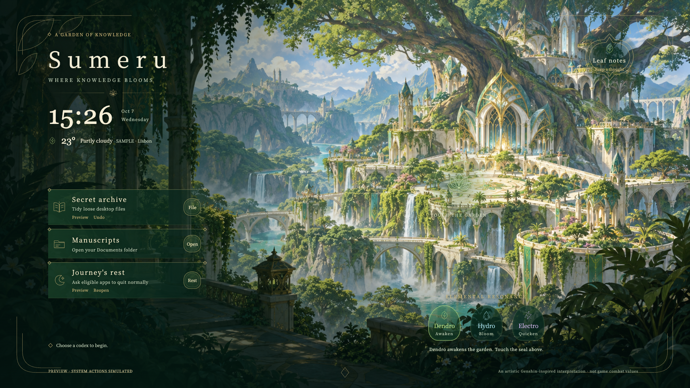

# AI Desktop Designer

**English** · [简体中文](README.zh-CN.md)

**An AI desktop design skill · Windows & macOS**

### Turn a world you love into a desktop you can live in.

[](https://github.com/XIANYU-HW/ai-desktop-designer/actions/workflows/ci.yml)
[**Enter the showcase →**](https://xianyu-hw.github.io/ai-desktop-designer/?lang=en) · [Try Three-Body](https://xianyu-hw.github.io/ai-desktop-designer/themes/threebody-observatory/?demo=1&lang=en) · [Try Sumeru](https://xianyu-hw.github.io/ai-desktop-designer/themes/genshin-sumeru/?demo=1&lang=en) · [Get started](#get-started)

In the morning, keep a thought beneath Sumeru's canopy. Late at night, file away the day at an observatory beneath three suns.

Move the pointer, and the star chart responds. Touch the garden, and elements bloom among its leaves. The clock, notes, timer and folders you use every day each find a place in that world.

**You bring the imagination. AI turns it into a desktop for living and working.**

AI Desktop Designer is a **desktop design skill for AI coding assistants such as Codex and Claude Code**, with a theme engine and local tools that can also run on their own. It starts with what gives a theme its character, then designs its imagery, movement, interactions and everyday functions together.

---

## 01 / Three-Body · Civilization Observatory

### Leave a little order in an unpredictable world.

[](https://xianyu-hw.github.io/ai-desktop-designer/themes/threebody-observatory/?demo=1&lang=en)

A desolate landscape. Bronze observatory rings. Three stars in deep space. This world draws on **unpredictability, observation and the continuity of civilization** in *The Three-Body Problem*: change the conditions you observe, then set aside a dependable stretch of time for your own work.

| What you do | How the world responds |
|---|---|
| Switch between stable and chaotic eras | The three suns change their paths, spacing and observation state |
| Move the pointer or click the star field | Observation markers and a local perturbation respond to your intervention |
| Begin a focus session | A 25-minute countdown keeps one task in view |
| File your work, open your records or wind down | Civilization Archive, Civilization Library and Silent Watch provide familiar tools with clear descriptions of their real effects |

[**Enter the observatory →**](https://xianyu-hw.github.io/ai-desktop-designer/themes/threebody-observatory/?demo=1&lang=en)

*A visual interpretation of a literary world. The bounded trajectories are an illustrative model, not an astronomical forecast or a validated scientific simulation.*

## 02 / Genshin Impact · Sumeru Garden of Knowledge

### Let knowledge grow, and everyday work become part of the landscape.

[](https://xianyu-hw.github.io/ai-desktop-designer/themes/genshin-sumeru/?demo=1&lang=en)

A tree city and waterfalls open into the distance. Time rests in the shade, and tools become scrolls in a garden. **The connections between knowledge, nature and the elements** shape this theme: richer ornament, brighter colors and functions placed where they belong within the scene.

| What you do | How the world responds |
|---|---|
| Choose Dendro, Hydro or Electro, then touch the garden | Botanical seals, blooms and branching light create distinct elemental responses |
| Rest the pointer | Waterlight and drifting leaves keep the scene gently alive |
| Open Leaf Notes | Capture a thought and save it locally in the current browser |
| Use Secret Archive, Manuscripts or Journey's Rest | Everyday tools take the form of botanical ornaments and scroll controls |

[**Walk through the garden →**](https://xianyu-hw.github.io/ai-desktop-designer/themes/genshin-sumeru/?demo=1&lang=en)

*An original fan scene with elemental interactions. It does not reproduce game screenshots or mechanics. Both showcases are unofficial, with no affiliation or endorsement. [Artwork and creative notes](docs/showcase-art.md)*

> **About the live demos:** Files, applications and weather use sample data. System-action buttons demonstrate feedback; they do not access your files or close applications. The timer and notes work in the browser, with notes stored only in that browser. The screenshots show the actual running theme pages.

---

## It began with a desktop cleanup.

First came a simple wish: put the scattered files in order. Then the cleanup button needed to belong in the picture, and the weather and clock needed to feel like part of the scenery. Soon, rivers needed to flow, stars needed to respond to the pointer, and changing a theme needed to change the character of the whole desktop.

Iteration left behind a method: **understand the theme, design the whole scene, make its functions work, test it yourself, and keep the previous world safe.** AI Desktop Designer puts that method into a skill—for an AI assistant, and for the next person with an idea.

## What does the skill teach an AI to do?

**Go from “what I love” to “how I work within it.”**

1. **Find the theme's core** — Connect its setting, mood, materials, composition and behavior. Literature, games, photography, static typography and practical workspaces are all valid starting points.
2. **Design the whole desktop** — Build the background, information, controls, input, feedback and motion together. Controls can live in one place or across the scene; required functions stay part of the design.
3. **Make useful functions real** — Reuse filing, folder access and wind-down actions, or build a timer, notes, media controls or a new workflow. The brief determines the scope.
4. **Inspect the result and refine it** — Review rendered screenshots for clarity and composition, click through actual state changes, test file operations with disposable data, and record desktop-host checks separately.
5. **Preserve the previous world** — Give new themes their own directories, retain existing configuration and user data, and follow the user's authorization for installation, startup and publication.

The two featured worlds demonstrate finished designs. Their layouts, materials, functions and motion are all open to reinvention.

### A prompt to start with

> Use ai-desktop-designer to make a deep-sea research station desktop around exploration and recordkeeping. Include tasks, a library shortcut and a focus timer. Let the sonar sweep respond to the pointer. Keep it quiet, preserve my current theme, and show me the working result in a browser first.

Or change just one detail:

> Keep the current composition. Make the river flow along its actual channel, reduce decoration across the screen, and weave the file-organizing feedback into the scene.

## Get started

### Try it first

[Open the live showcase](https://xianyu-hw.github.io/ai-desktop-designer/?lang=en). No download or desktop permissions are needed. A desktop browser gives you the fullest interaction experience. Switch between English and Simplified Chinese in the showcase; its previews and demo links follow your selection.

### Ask an AI to design your desktop

Clone the repository into your assistant's skills directory, then describe what you want:

```bash
# Codex — macOS / Linux
git clone https://github.com/XIANYU-HW/ai-desktop-designer ~/.agents/skills/ai-desktop-designer

# Claude Code — macOS / Linux
git clone https://github.com/XIANYU-HW/ai-desktop-designer ~/.claude/skills/ai-desktop-designer
```

```powershell
# Windows PowerShell — Codex
git clone https://github.com/XIANYU-HW/ai-desktop-designer "$env:USERPROFILE\.agents\skills\ai-desktop-designer"

# Windows PowerShell — Claude Code
git clone https://github.com/XIANYU-HW/ai-desktop-designer "$env:USERPROFILE\.claude\skills\ai-desktop-designer"
```

[SKILL.md](SKILL.md) is the entry point; invoke the skill with `$ai-desktop-designer`. It guides the assistant through requirements, design, implementation, visual and interaction checks, and authorized installation.

The project was previously named Orbit Desktop. After updating an existing skill, you can rename its installation folder to `ai-desktop-designer`. The bundled local helper retains the Orbit name, the `~/OrbitDesktop` workspace and its existing commands for compatibility with installed themes and configuration.

### Run the examples directly

[Download the ZIP](https://github.com/XIANYU-HW/ai-desktop-designer/archive/refs/heads/main.zip) and extract it:

| Platform | Launch | Desktop host |
|---|---|---|
| Windows 10/11 | Double-click `start-windows.bat` | [Lively Wallpaper](https://www.rocksdanister.com/lively/) |
| macOS | Double-click `start-mac.command`; use right-click → Open if needed on first launch | [Plash](https://apps.apple.com/app/plash/id1494023538) |
| Linux | Start with Python and preview in a browser | No native desktop integration provided |

The local helper requires **Python 3.9+ and uses only its standard library**. A new workspace starts with the Three-Body theme; an existing theme selection is preserved. The launcher menu lets you preview and switch themes, set a weather location, and apply a theme to the desktop when you choose. Starting at login is opt-in.

## Capabilities and boundaries

| Capability | Current implementation |
|---|---|
| Visuals and interaction | HTML/CSS/Canvas/SVG and local assets. The showcase themes cap animation rates and canvas scale, and respect pause, hidden-page and reduced-motion settings. Actual resource use depends on the device and host. |
| File organization | Action previews are available; filing and wind-down in both featured themes require confirmation. Filing moves and journals files without deleting them. Undo checks file identity and content; changed or uncertain files are left for review. |
| Wind-down | Lists applications before requesting normal closure. It never force-quits or answers save prompts. Browser-tab and session restoration depend on each application. |
| AI input and model selection | **There is no universal built-in bridge.** Implement against the chosen application's real interface and distinguish opening a draft, successfully sending it, and receiving an answer. |
| Desktop input | Browsers, Plash and Lively have different capabilities. Complex input, input methods and window layering need verification in the actual host. |
| Verification | Automatic checks, browser captures, actual interaction tests and desktop-host checks are recorded separately. CI cannot certify visual quality or replace acceptance on the target device. |

The local helper listens only on `127.0.0.1`; protected endpoints validate the token, Host and Origin. Themes can invoke local functions, and custom actions can execute code, so review their source before use. This is not a code sandbox. The project is independent of the existing native Mac ORBIT application and does not automatically replace its desktop or configuration.

<details>
<summary>Project structure, commands and starter examples</summary>

```text
SKILL.md              The AI's working method
references/           Design, implementation, review and host guides
themes/               Two featured worlds + three starter examples
sdk/                  Page SDK and theme gallery
actions/              tidy-files / quit-apps / open-path
runtime/              Local Python helper
templates/            Replaceable theme and action scaffolds
tests/                Cross-platform automated tests
```

```text
python runtime/orbit.py doctor | init | start | stop | themes | use ID | gallery
python runtime/orbit.py new-theme ID [--from THEME] | validate ID | snapshot ID
python runtime/orbit.py review ID [--quick] [--out FOLDER]
python runtime/orbit.py actions | run ACTION [OP] [--param KEY=VALUE] [--yes]
python runtime/orbit.py install [--autostart] | uninstall | autostart on|off
```

Use `python3` on macOS / Linux if needed. The user workspace defaults to `~/OrbitDesktop`, separate from the repository. Uninstalling stops the helper and removes its startup entry; entries in the desktop host may still need to be removed manually.

The starter examples remain available to explore different approaches:

- [Ink Study](https://xianyu-hw.github.io/ai-desktop-designer/themes/ink-study/?demo=1&lang=en): paper, ink, scrolls and traditional timekeeping.
- [Deep Orbit](https://xianyu-hw.github.io/ai-desktop-designer/themes/deep-orbit/?demo=1&lang=en): data-driven orbits and debris.
- [Defrag 95](https://xianyu-hw.github.io/ai-desktop-designer/themes/defrag-95/?demo=1&lang=en): retro windows and visible filing progress.

Further reading: [Design principles](references/design-principles.md) · [Theme guide](references/theme-guide.md) · [Review method](references/quality-review.md) · [Design cases](references/design-cases.md) · [Showcase verification](docs/showcase-verification.md)

</details>

## License & credits

Code: **MIT**. The two featured worlds are unofficial fan showcases with no affiliation or endorsement. Generated art, thematic references and font licenses are documented in [artwork provenance](docs/showcase-art.md). Third-party names and fictional properties belong to their respective rights holders. Lively and Plash are independent projects.
